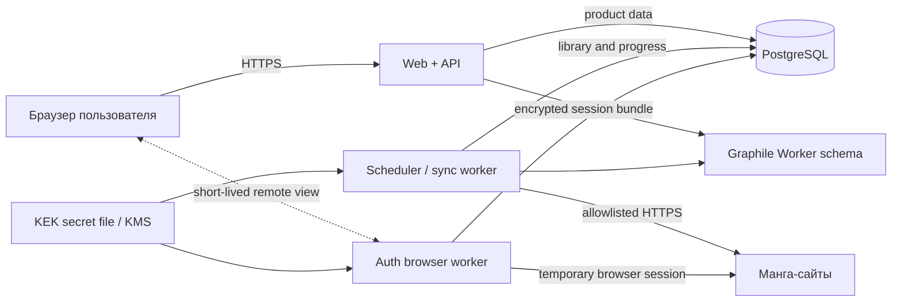

# Архитектура Manga Hub MVP

Статус: проект устройства, 20 сентября 2026 года. Сейчас в репозитории только документация.

## Границы системы

Manga Hub хранит профили своих пользователей, зашифрованные сессии подключённых манга-сайтов и нормализованное состояние личных библиотек. Он не индексирует полный каталог площадок и не получает содержимое глав.

Первый MVP выполняет только pull-синхронизацию:

```text
личные библиотеки источников → Manga Hub
```

Направление Manga Hub → источник в MVP отсутствует. Благодаря этому ошибочное сопоставление не меняет чужой аккаунт, а повторный запуск остаётся безопасным.

## Стек

- **Next.js + React + TypeScript** — сайт и HTTP API.
- **PostgreSQL** — пользовательские данные, библиотека, наблюдения прогресса, аудит и очередь.
- **Drizzle + node-postgres** — схема, миграции и продуктовые запросы.
- **Better Auth** — email/password и серверные PostgreSQL-сессии. Для паролей настраивается Argon2id.
- **Graphile Worker** — периодические и фоновые задания поверх той же PostgreSQL без Redis.
- **Playwright + Chromium** — интерактивный вход на источники и browser-only адаптеры.
- **libsodium / XChaCha20-Poly1305** — authenticated encryption сессионных пакетов.
- **Node.js LTS + npm** — один runtime и lockfile для web, API и workers.

Версии зависимостей фиксируются lockfile при создании каркаса, а не в документе.

## Процессы



### Web + API

Отдаёт интерфейс, проверяет сессию Manga Hub, валидирует входные данные и читает нормализованную библиотеку. API не возвращает cookies/tokens и в production не получает ключ их расшифрования.

### Sync worker

Единственный компонент, которому разрешено расшифровывать сессии источников. Он валидирует подключение, вызывает provider adapter, сохраняет наблюдения и обновляет представление библиотеки.

### Auth browser worker

Создаёт отдельный Chromium context на одну попытку подключения. Пользователь сам выполняет вход на сайте источника. После подтверждения сессии worker сериализует только нужные cookies/storage state, шифрует пакет и полностью удаляет временный профиль.

Транспорт UI отделён от логики:

- `local-window` открывает видимый Chromium на машине разработчика;
- `remote-stream` на Ubuntu отдаёт временную браузерную сессию через защищённый browser gateway.

Оба режима используют один контракт `AuthBrowserTransport`. В проекте нет кода, привязанного к macOS. Production gateway получает одноразовый подписанный URL на 10–15 минут, не записывает видео/клавиатуру, отключает clipboard/downloads/devtools и ограничивает исходящий трафик доменами конкретного адаптера. CAPTCHA и 2FA проходит пользователь; сервис их не обходит.

Если источник однажды предоставит официальный OAuth, адаптер использует его вместо браузерной сессии.

## Локальный и серверный запуск

Локально без Docker:

```text
npm run dev          # Next.js + API
npm run worker:dev   # scheduler, sync и auth browser worker
native PostgreSQL
```

На Ubuntu:

```text
reverse proxy / TLS
web-api container
worker container
auth-browser container
postgres container or managed PostgreSQL
```

Web и worker собираются из одного multi-stage image и запускаются разными командами. Chromium находится только в auth/browser worker image, поэтому основной web image остаётся небольшим. Конфигурация передаётся одинаковыми именами переменных и secret files. Схема и миграции общие для обоих режимов.

## План репозитория

```text
manga-hub/
├── docs/
│   ├── PLAN.md
│   ├── ARCHITECTURE.md
│   ├── SECURITY.md
│   └── SOURCES.md
├── src/
│   ├── app/
│   │   ├── (auth)/
│   │   │   ├── sign-in/
│   │   │   └── sign-up/
│   │   ├── (app)/
│   │   │   ├── library/
│   │   │   ├── connections/
│   │   │   ├── matches/
│   │   │   └── sync-runs/
│   │   └── api/
│   │       ├── auth/[...all]/
│   │       └── v1/
│   ├── components/
│   ├── features/
│   │   ├── auth/
│   │   ├── connections/
│   │   ├── library/
│   │   ├── matching/
│   │   └── sync/
│   └── server/
│       ├── api/
│       ├── auth/
│       ├── db/
│       ├── crypto/
│       ├── queue/
│       └── repositories/
├── packages/
│   ├── domain/                 # общие типы и правила
│   └── connectors/
│       ├── contract.ts
│       ├── registry.ts
│       ├── remanga/
│       ├── mangalib/
│       ├── readmanga/
│       └── inkstory/
├── workers/
│   ├── main.ts
│   ├── auth-browser/
│   ├── scheduler/
│   └── tasks/
├── db/migrations/
├── scripts/
├── tests/
│   ├── fixtures/               # обезличенные ответы без секретов
│   ├── integration/
│   └── unit/
├── Dockerfile
├── compose.yaml
├── .env.example
└── package.json
```

Пустые каталоги заранее не создаются. Они появляются вместе с рабочим вертикальным срезом.

## Контракт provider adapter

Адаптер не получает произвольный URL от пользователя. Он работает с allowlist доменов и объявляет возможности источника.

```ts
type ProviderCapabilities = {
  libraryRead: boolean;
  progressRead: boolean;
  explicitReadSet: boolean;
  lastReadOnly: boolean;
  deltaSync: boolean;
  browserRequired: boolean;
};

interface ProviderAdapter {
  readonly code: ProviderCode;
  readonly capabilities: ProviderCapabilities;
  readonly allowedOrigins: readonly string[];

  verifySession(session: ProviderSession): Promise<RemoteProfile>;
  listLibrary(
    session: ProviderSession,
    cursor?: string,
  ): Promise<Page<RemoteLibraryEntry>>;
  readProgress(
    session: ProviderSession,
    entry: RemoteLibraryEntry,
  ): Promise<RemoteProgress>;
  listChanges?(
    session: ProviderSession,
    cursor?: string,
  ): Promise<ChangePage>;
}
```

В контракте MVP нет `searchCatalog`, `downloadChapter`, `addToLibrary` и `writeProgress`.

HTTP/JSON используется, когда это устойчиво для текущей пользовательской сессии. DOM parsing служит fallback. Playwright остаётся для входа, challenge-страниц и источников, которым необходим браузер. Каждый адаптер преобразует ответ в общий тип до записи в БД.

## Состояния подключения

```text
pending_auth
→ awaiting_user
→ validating
→ importing
→ active
```

Боковые состояния:

- `reauth_required` — сессия истекла или отозвана;
- `needs_attention` — CAPTCHA/2FA/challenge требует пользователя;
- `rate_limited` — источник попросил уменьшить частоту;
- `degraded` — временная ошибка или частично сломанный parser;
- `disabled` — пользователь отключил соединение.

Повторный вход заменяет только encrypted session bundle. Библиотека, сопоставления и история наблюдений сохраняются.

## Основные таблицы PostgreSQL

### Профиль Manga Hub

Таблицы `user`, `session`, `account` и `verification` принадлежат Better Auth. Продуктовые запросы всегда ограничиваются `user_id`. Browser session Manga Hub и сессия внешнего источника — разные сущности.

### Источники и подключения

| Таблица | Назначение |
| --- | --- |
| `sources` | Постоянный код источника, название, capabilities и состояние адаптера |
| `source_domains` | Разрешённые текущие/прежние домены и дата проверки |
| `source_connections` | Связь пользователя с внешним аккаунтом, внешний ID, display name, состояние и расписание |
| `source_secrets` | Encrypted session bundle, wrapped DEK, nonces, версии формата и KEK |
| `connection_auth_attempts` | Одноразовая попытка входа, TTL, состояние и безопасная причина завершения |
| `sync_cursors` | Cursor, ETag/hash и watermark отдельно для операции адаптера |

`source_connections` имеет уникальность `(user_id, source_id, remote_account_id)`. Схема допускает несколько аккаунтов одного источника, хотя UI MVP показывает один.

### Личная библиотека

| Таблица | Назначение |
| --- | --- |
| `works` | Внутренняя каноническая сущность произведения |
| `work_titles` | Оригинальные, альтернативные и нормализованные названия с происхождением |
| `source_titles` | Карточка конкретного источника: `(source_id, external_id)`, URL и минимум метаданных |
| `work_mappings` | Связь `source_title → work`, метод, confidence и решение пользователя |
| `user_library_entries` | Единая запись произведения в личной библиотеке Manga Hub |
| `source_library_entries` | Присутствие произведения в конкретном внешнем аккаунте, статус и remote timestamps |
| `source_chapters` | Главы конкретного источника, обнаруженные только для личной библиотеки |
| `progress_observations` | Неизменяемый факт, увиденный адаптером, с исходным marker и временем |
| `source_progress` | Текущее вычисленное состояние на одном подключении |
| `match_candidates` | Неоднозначные пары для ручного подтверждения/разделения |

Ключевые уникальности:

```text
source_titles          (source_id, external_id)
source_library_entries (source_connection_id, source_title_id)
source_chapters        (source_title_id, external_id)
user_library_entries   (user_id, work_id)
source_progress        (source_connection_id, source_title_id)
```

### Синхронизация и аудит

| Таблица | Назначение |
| --- | --- |
| `sync_runs` | Запуск, режим, состояние, счётчики и безопасная ошибка |
| `sync_run_items` | Результат отдельного тайтла без секретного payload |
| `audit_events` | Вход, подключение, переподключение, удаление и операции с ключами |

В payload Graphile Worker передаются только внутренние ID и режим операции. Cookies, токены, логины, пароли и тела внешних ответов в очередь не попадают.

## Модель прогресса

Главная ошибка, которой нужно избежать, — свести любую главу к целому числу.

`progress_observations` хранит:

- внешний ID главы, если он есть;
- исходную метку: `12`, `12.5`, `Экстра 4`, `Пролог`;
- volume/number/part только если их удалось разобрать без потери;
- семантику источника: `explicit_read_set`, `last_read`, `completed_only`;
- `remote_updated_at`, `observed_at` и endpoint/метод адаптера;
- исходный безопасный hash ответа для диагностики изменений, но не полный ответ.

Прогресс источников отображается раздельно. Числовой максимум между сайтами не объявляется истиной, пока главы не сопоставлены уверенно. Статус `completed` не создаёт выдуманный набор прочитанных глав.

## Сопоставление произведений

Порядок автоматического сопоставления:

1. общий внешний ID, если источник его сообщает;
2. нормализованное оригинальное название + автор + год/тип;
3. альтернативные названия с единственным уверенным кандидатом;
4. ручное решение пользователя.

Совпадение только по одному популярному названию не объединяет записи. Ручное решение сохраняется отдельно и имеет приоритет над последующими эвристиками.

В MVP главы между источниками не объединяются в единый read-set для обратной записи. Интерфейс показывает исходные прогрессы рядом; это честнее при разных переводах, экстрах и разбиении глав.

## Jobs и расписание

Основные задания:

```text
connection.validate
connection.initial_import
connection.incremental_sync
connection.full_reconcile
connection.session_health
work.resolve
secret.rewrap
cleanup.auth_attempts
```

Graphile Worker владеет своей служебной схемой PostgreSQL и обеспечивает durable queue, retries и cron; Drizzle migrations владеют только продуктовыми таблицами. Задания проектируются как at-least-once и поэтому остаются идемпотентными. Для одного `source_connection_id` используется именованная очередь/блокировка, исключающая параллельные импорты.

Расписание:

- initial import — сразу после подключения;
- incremental sync — примерно раз в час с jitter;
- full reconcile — раз в неделю;
- session health — перед каждой синхронизацией;
- очистка истёкших auth attempts — регулярно.

## Поведение при ошибках

- `401`, redirect на login или отсутствие обязательной cookie: `reauth_required`.
- `403`/challenge: запросы прекращаются, `needs_attention`; обход challenge не выполняется.
- `429`: учитывать `Retry-After`, затем exponential backoff с jitter.
- `5xx`/timeout: ограниченные повторы; последняя успешная версия остаётся доступной.
- Нарушение schema/parser invariant: запуск `partial` или `failed`, никакого массового удаления.
- Тайтл считается удалённым из внешней библиотеки только после успешной полной сверки; наблюдения не стираются.

## API и контроль доступа

Все endpoints кроме sign-up/sign-in требуют действующую сессию Manga Hub. Каждый repository method получает `userId`; ID ресурса сам по себе никогда не даёт доступ. Мутации проверяют Origin/CSRF и используют строгие схемы входных данных.

API возвращает только нормализованные поля. Диагностические сведения адаптера фильтруются по allowlist; response body, request headers, cookies, Authorization и browser storage в ответ не попадают.

## Ссылки на технические основания

- [Better Auth: PostgreSQL и Drizzle](https://better-auth.com/docs/installation)
- [Better Auth: security](https://better-auth.com/docs/reference/security)
- [Graphile Worker: PostgreSQL job queue](https://worker.graphile.org/docs)
- [Playwright: authentication state](https://playwright.dev/docs/auth)
- [OWASP: Secrets Management](https://cheatsheetseries.owasp.org/cheatsheets/Secrets_Management_Cheat_Sheet.html)
- [Docker Compose secrets](https://docs.docker.com/compose/how-tos/use-secrets/)
